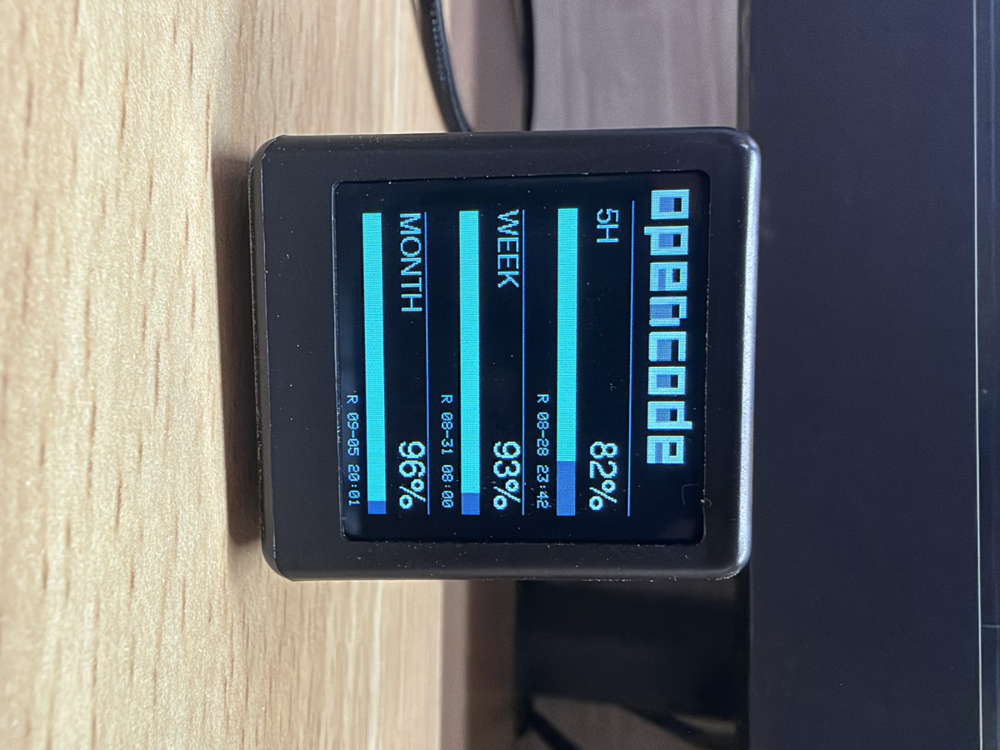

# SD2 小电视 · OpenCode Go 额度显示器

在 [SD2 小电视](https://oshwhub.com/Q21182889/esp-xiao-dian-shi)（ESP8266 + 1.3 寸 ST7789 240×240 屏幕）上直接显示 OpenCode Go（Zen / Go 套餐）的 5 小时、周、月额度剩余量。

固件通过 HTTPS 请求 OpenCode 官方接口 `GET https://opencode.ai/zen/go/v1/usage`，不需要额外客户端/服务器，也不需要 CC Switch 常驻。

## 屏幕效果



## 显示内容

- 三行额度：**5H**（5 小时滚动额度）、**WEEK**（周额度）、**MONTH**（月额度）
- 每行显示剩余百分比、进度条和重置时间（如 `R 08-28 22:00`，本地时区）
- 默认每 5 分钟自动刷新（`config.h` 可改）
- 定时休眠：默认 00:00-07:00 关闭显示并停止获取数据（`config.h` 可改）

剩余量按 CC Switch 的提取规则计算：`剩余 = max(100 - percent, 0)`。

## 硬件

| 项目 | 说明 |
|------|------|
| 主控 | ESP8266（ESP-12E/F），PlatformIO `board = nodemcuv2` |
| 屏幕 | ST7789，240×240，SPI，**无 CS**，MISO 未接 |
| 烧录 | Micro USB + 板载 CH340 |

引脚（已固化在 `lib/sd2-common/platformio/tft_setup.h`）：

| 功能 | NodeMCU | GPIO |
|------|---------|------|
| TFT DC | D3 | GPIO0 |
| TFT RST | D4 | GPIO2 |
| TFT SCLK | D5 | GPIO14 |
| TFT MOSI | D7 | GPIO13 |
| 背光 | D1 | GPIO5 |

## 快速开始

1. 克隆工程时使用 `git clone --recursive <仓库地址>`（或克隆后执行 `git submodule update --init`）。公共库 [`sd2-common`](https://github.com/Joee-D/sd2-common) 会作为子模块出现在 `lib/sd2-common`，构建时自动编译。
2. 用 VS Code 打开本工程（已安装 PlatformIO 插件）。
3. 复制 `src/config.example.h` 为 `src/config.h`，然后编辑：
   - `WIFI_SSID` / `WIFI_PASSWORD`：你的 WiFi
   - `OPENCODE_GO_API_KEY`：在 OpenCode 的 Zen / Go 套餐页获取 Anthropic 兼容 API Key（`sk-` 开头）
   - `POLL_INTERVAL_MS`：刷新间隔（默认 5 分钟）
   - `BRIGHTNESS`：屏幕亮度（0~1023，默认 800）
4. USB 连接小电视，终端执行 `pio run -t upload`。
5. 执行 `pio device monitor -b 921600` 可查看请求日志。

## 目录结构

```
src/
├── main.cpp          主程序：TFT_eSPI 界面、WiFi、NTP、周期刷新
├── OpenCodeGoClient.h HTTPS 用量查询（WiFiClientSecure + BearSSL）
├── cert.h            Google GTS Root R4 根证书（TLS 校验）
├── config.example.h  配置模板（复制为 config.h 后填写，config.h 不入库）
└── config.h          本地配置（.gitignore 忽略，不会提交）
lib/sd2-common/       公共库子模块：WiFi 连接/校时/休眠/背光/HTTP/格式化
images/               屏幕效果图
```

> 与 [`sd2-deepseek-balance`](https://github.com/Joee-D/sd2-deepseek-balance)、[`sd2-openwrt-traffic`](https://github.com/Joee-D/sd2-openwrt-traffic) 共用的基础功能（WiFi、NTP、定时休眠、背光、HTTP、格式化）已提炼到 [`sd2-common`](https://github.com/Joee-D/sd2-common)，本工程只保留 OpenCode Go 额度相关的界面与请求逻辑。

## 工作原理

1. 开机显示连接页，连接 WiFi。
2. 通过 NTP 同步系统时间（ESP8266 无 RTC，校验证书前必须有正确时间）。
3. 用 WiFiClientSecure 建立 TLS 连接，校验 GTS Root R4 根证书，请求 `GET /zen/go/v1/usage`，携带 `Authorization: Bearer <key>`、`x-opencode-session: sd2-opencode-go-balance-<chipId>`（User-Agent 保持 `cc-switch/1.0`，与 CC Switch 预设一致）。
4. 解析 `usage.rolling` / `usage.weekly` / `usage.monthly` 的 `status`、`percent`、`resetsAt` 并绘制三行额度。
5. 每 5 分钟自动刷新。TLS 握手期间会临时关闭软看门狗，结束请求后立即恢复，避免阻塞握手触发硬件复位导致设备重启。

## 常见问题

**1. 显示 “Network error”**

设备连不上 `opencode.ai:443`。确认 WiFi 能上网，看串口日志中 `TLS connect failed` 的具体 SSL 错误。若确为证书链异常，可把 `config.h` 中 `VERIFY_TLS_CERT` 改为 `0`（不推荐长期使用）。

**2. 显示 “Bad API key” 或 “No Go plan”**

`config.h` 里的 Key 填错/已失效，或当前 Key 没有有效的 OpenCode Go 订阅。

**3. 屏幕花屏 / 无显示**

- 确认是 ST7789 240×240（SD2 标准配置）；屏幕驱动与引脚已固化在 `lib/sd2-common/platformio/tft_setup.h`，仅当硬件不同时才需要改。
- 背光亮度：`config.h` 中 `BRIGHTNESS`（0~1023）。

**4. 烧录失败**

- 确认数据线是数据线（不是纯充电线）。
- 上传波特率默认 921600，失败可改为 `upload_speed = 115200`。

## 参考

- CC Switch 用量接口/提取器：https://github.com/farion1231/cc-switch/issues/2260
- 硬件开源：https://oshwhub.com/Q21182889/esp-xiao-dian-shi
- 固件参考：https://github.com/Jason6111/sd2
